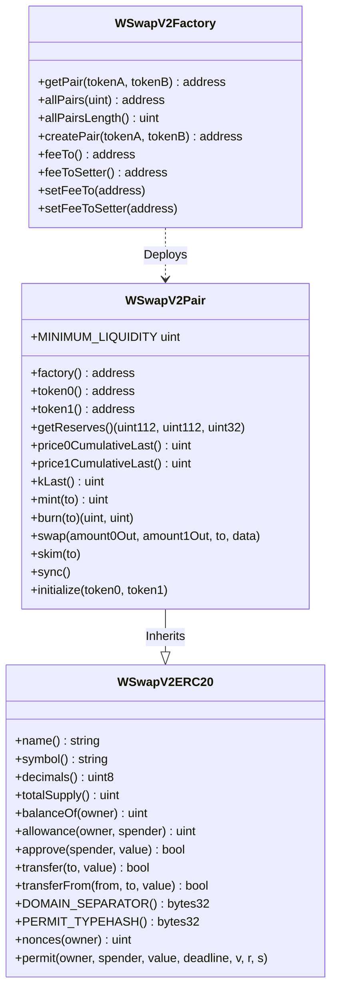
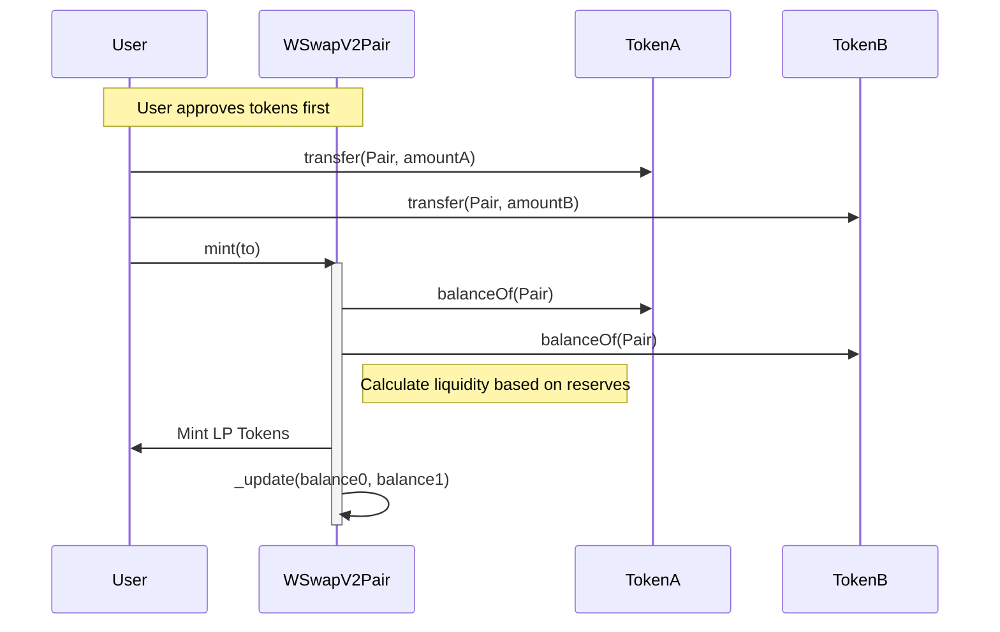
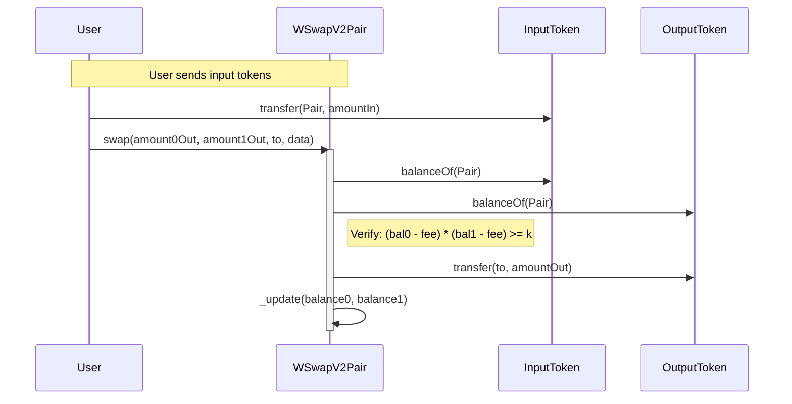
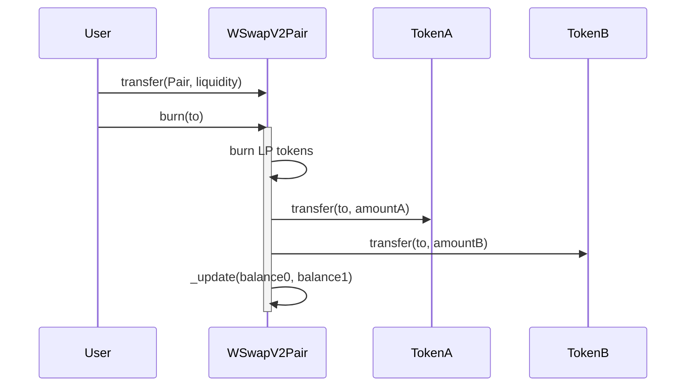

# W Swap Smart Contracts

## Overview

**W Swap** is a decentralized exchange (DEX) protocol based on the Uniswap V2 Automated Market Maker (AMM) model. It enables trustless token swaps and liquidity provision on the W Chain.

This repository contains the core smart contracts for the W Swap protocol, including the Factory, Pairs, and LP Tokens.

## Architecture

The W Swap protocol consists of three main components:

1.  **WSwapV2Factory**: The core registry that deploys and tracks all Pair contracts.
2.  **WSwapV2Pair**: The AMM contract that holds liquidity for a specific token pair and executes swaps.
3.  **WSwapV2ERC20**: The LP token implementation, inherited by the Pair contract.

### System Diagram



## Core Contracts

### WSwapV2Factory
*   **Location**: `src/WSwapV2Factory.sol`
*   **Role**: Acts as the single source of truth for all W Swap pairs.
*   **Key Functions**:
    *   `createPair(address tokenA, address tokenB)`: Deploys a new Pair contract using `create2` for deterministic addresses.
    *   `setFeeTo(address)`: Sets the recipient of the protocol fee (if enabled).

### WSwapV2Pair
*   **Location**: `src/WSwapV2Pair.sol`
*   **Role**: Stores liquidity and executes swaps for a specific pair of tokens.
*   **Key Logic**:
    *   Implements the constant product formula: `x * y = k`.
    *   Manages reserves (`reserve0`, `reserve1`) and price accumulators.
    *   Supports flash swaps via `IUniswapV2Callee`.

### WSwapV2ERC20
*   **Location**: `src/WSwapV2ERC20.sol`
*   **Role**: ERC-20 implementation for Liquidity Provider (LP) tokens.
*   **Name/Symbol**: `WLP V2` / `WLP-V2`.
*   **Features**: Includes EIP-2612 `permit` for gasless approvals.

## Key Workflows

### 1. Pair Creation
A new pair is created by calling the Factory. This is a one-time setup for each unique token pair.

### 2. Adding Liquidity
Liquidity providers deposit both tokens into the Pair contract and receive LP tokens in return.



### 3. Swapping
Users trade one token for another. The Pair ensures the constant product invariant (`k`) is maintained (minus fees).



### 4. Removing Liquidity
Liquidity providers burn their LP tokens to reclaim their share of the underlying assets.



## Development

This project uses [Foundry](https://book.getfoundry.sh/).

### Build

```shell
$ forge build
```

### Test

Tests are located in the `test/` directory.

```shell
$ forge test
```

### Deploy

Create a deployment script in the `script/` directory (e.g., `script/Deploy.s.sol`) and run:

```shell
$ forge script script/Deploy.s.sol:DeployScript --rpc-url <your_rpc_url> --private-key <your_private_key> --broadcast
```
